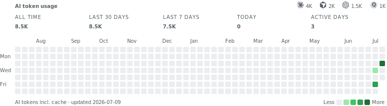

# ai-usage-heatmap

<picture>
  <source media="(prefers-color-scheme: dark)" srcset="https://raw.githubusercontent.com/rnaidu-parallel/ai-usage-heatmap/master/assets/ai-usage-dark.svg">
  
</picture>

Show your AI usage on your GitHub profile, powered by the tracker you already use.

`ai-usage-heatmap` is a zero-dependency Node CLI that turns local exports from [tokscale](https://github.com/junhoyeo/tokscale) or [ccusage](https://github.com/ryoppippi/ccusage) into GitHub-contribution-style SVG files. It does not count raw agent logs. Counting stays in the tracker you trust. This tool renders the daily totals and helps you publish them.

No server, no signup, and only daily aggregate totals ever reach the SVG.

## What it is

This is a display layer for GitHub profile READMEs.

It reads one of these sources:

- `tokscale graph`
- `ccusage daily --json`
- a bring-your-own JSON array of `{ "date": "YYYY-MM-DD", "total": 123 }`

It writes:

- `assets/ai-usage-dark.svg`
- `assets/ai-usage-light.svg`
- the `<picture>` snippet for your README

## Quickstart

Install Node 22 or newer, then install either tokscale or ccusage.

From your profile README repo:

```sh
npx ai-usage-heatmap render --out-dir assets
```

Add this block to `README.md`:

```html
<picture>
  <source media="(prefers-color-scheme: dark)" srcset="assets/ai-usage-dark.svg">
  
</picture>
```

Commit and push the generated SVG files.

```sh
git add assets/ai-usage-*.svg README.md
git commit -m "Update AI usage heatmap"
git push
```

Run it on your own schedule. A daily cron is enough:

```cron
0 8 * * * cd ~/your-profile-repo && npx ai-usage-heatmap render --out-dir assets && git add assets/ai-usage-*.svg README.md && git commit -m "Update AI usage heatmap" && git push
```

You can also print the snippet and setup notes:

```sh
npx ai-usage-heatmap init --out-dir assets
```

## Supported sources

Use your installed tracker directly:

```sh
npx ai-usage-heatmap render --source auto --out-dir assets
```

With no `--input`, `auto` tries `tokscale graph` first, then `ccusage daily --json`. It uses your locally installed binaries through `PATH`. It never runs `npx` for the tracker.

Use a saved tokscale export:

```sh
tokscale graph > tokscale-graph.json
npx ai-usage-heatmap render --source tokscale --input tokscale-graph.json --out-dir assets
```

Use a saved ccusage export:

```sh
ccusage daily --json > ccusage-daily.json
npx ai-usage-heatmap render --source ccusage --input ccusage-daily.json --out-dir assets
```

Use the BYO JSON contract for anything else:

```json
[
  { "date": "2026-07-01", "total": 1200 },
  { "date": "2026-07-02", "total": 9800 }
]
```

```sh
npx ai-usage-heatmap render --source json --input usage.json --out-dir assets
```

With `--source auto --input file`, the CLI sniffs the file:

- object with `contributions` array: tokscale
- object with `daily` array: ccusage
- top-level array: BYO JSON

Recent ccusage versions include non-Claude tools in `daily`. That is ccusage's upstream scope decision and works well for an AI usage heatmap. If you want one tool only, export a filtered file yourself and pass it with `--input`.

## How the numbers are computed

The numbers are whatever your tracker reports, reduced to one total per day.

For tokscale:

- `--metric total`: `totals.tokens`
- `--metric io`: `tokenBreakdown.input + tokenBreakdown.output`

For ccusage:

- `--metric total`: `inputTokens + outputTokens + cacheCreationTokens + cacheReadTokens`
- `--metric io`: `inputTokens + outputTokens`

For BYO JSON:

- `total` is used as provided

The SVG caption states the selected metric: `AI tokens incl. cache` or `AI tokens in+out`.

Timezone and day bucketing are the tracker's job. Heatmap shades are relative quintiles of your active days, so a day's shade can shift as your history grows. The underlying daily values do not change.

## Claude Code 30-day retention gotcha

Trackers read Claude Code's local session logs. Claude Code deletes those logs after 30 days by default through `cleanupPeriodDays` in `~/.claude/settings.json`, so Claude history in any tracker is truncated unless you raise it.

Check your setup:

```sh
npx ai-usage-heatmap doctor
```

Set this in `~/.claude/settings.json`:

```json
{
  "cleanupPeriodDays": 99999
}
```

`doctor` also checks whether tokscale and ccusage are on `PATH`. When a source can run, it reports days, date range, and zero-day gaps.

## Privacy

Only `date` and `total` reach the renderer. No client names, model IDs, costs, file paths, project names, prompts, responses, or raw tracker metadata are written to the SVGs.

This tool has no server, no account, and no network calls. With no `--input`, it spawns only your locally installed tracker binaries: `tokscale` and `ccusage`.

## Flags

```sh
npx ai-usage-heatmap render [--source auto|tokscale|ccusage|json] [--input usage.json] [--out-dir assets] [--weeks 52] [--metric total|io] [--no-caption] [--today YYYY-MM-DD]
```

- `--source auto|tokscale|ccusage|json`: choose a source. Default: `auto`.
- `--input`: read a saved export. If omitted, `auto` tries local tracker binaries.
- `--out-dir`: where SVG files are written. Default: `assets`.
- `--weeks`: number of weeks in the heatmap window, from 1 to 520. Default: `52`.
- `--metric total|io`: cache-inclusive total or input/output only. Default: `total`.
- `--no-caption`: suppress the bottom-left caption.
- `--today`: pin the render date for tests or reproducible demos.

```sh
npx ai-usage-heatmap init [--out-dir assets]
npx ai-usage-heatmap doctor
```

## Roadmap

- Optional gist target for people who want a separate publishing flow.

## License

MIT.
